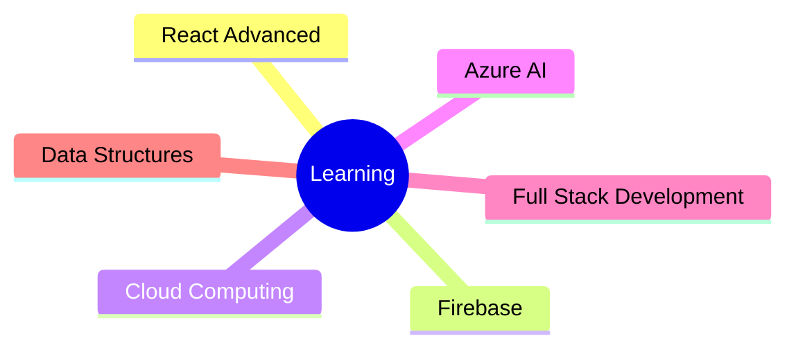

# 
Hi 👋 I'm Prannav P

  

---

## 🚀 About Me

🎓 B.Sc Software Systems Student at Kongu Engineering College

💻 Passionate Full Stack Developer

🎨 UI/UX Design Enthusiast

🏆 Hackathon Winner

🌱 Currently learning Advanced React, Firebase and Cloud Technologies

📫 Reach me at: **[prannav2511@gmail.com](mailto:prannav2511@gmail.com)**

⚡ Fun Fact: I love turning ideas into real-world applications.

 

---

## 🌐 Connect With Me

---

## 🛠️ Tech Stack

### Programming Languages

### Frameworks & Tools

### Databases

---

## 🚀 Featured Projects

### 🛒 ElectroStore

* React-based E-Commerce Application
* AI Chatbot Integration
* Online Payment Support
* Responsive User Interface

### 🌱 Fresh Flow

* React + Firebase Application
* Authentication & Cart Management
* Admin Dashboard
* Sales Tracking Features

### 🗳️ Online Voting System

* Mobile Application Prototype
* Role-Based Access Control
* Database Integration
* Secure Voting Workflow

---

## 🏆 Achievements

🥇 Winner – Xackathon Hackathon (₹15,000)

🥈 2nd Prize – Tamil Mandram Hackathon

🥉 Academic Excellence Award (₹17,500)

---

## 📜 Certifications

✔ Microsoft Azure AI Engineer Associate (AI-102)

✔ Python Essentials – Cisco Networking Academy

✔ Robotics Course – Mechatronics Department

---

## 📊 GitHub Statistics

---

## 🔥 GitHub Streak

---

## 📈 Contribution Graph

---

## 🏆 GitHub Trophies

  
</pv>

---

## 🌱 Currently Learning

---

## 💼 Career Objective

Aspiring Full Stack Developer seeking opportunities to contribute to innovative projects, enhance technical expertise, and build impactful software solutions.

---

### ⭐ If you like my work, consider giving a star to my repositories!

